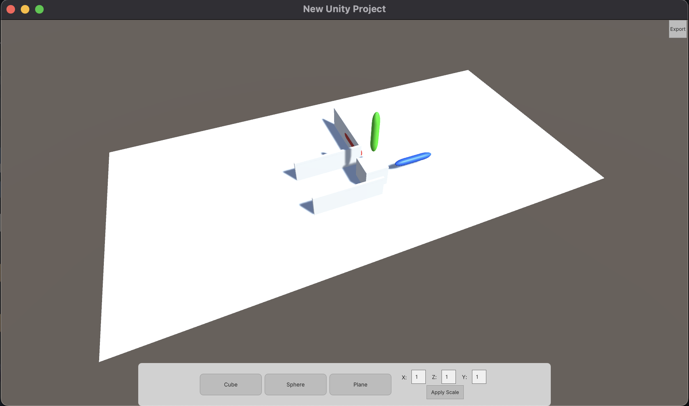

# MuJoCo RL Environment Design Tool
## WARNING - WORK IN PROGRESS
A little warning up front. This tool is still in a very early stage of development and apart from adding a bunch of loating planes, cubes and spheres, there is not much more you can do with this at the moment. More informations below. 

(<a href="#top">back to top</a>)

## 📖 Table of Contents
- [MuJoCo RL Environment Design Tool](#mujoco-rl-environment-design-tool)
  - [WARNING - WORK IN PROGRESS](#warning---work-in-progress)
  - [📖 Table of Contents](#-table-of-contents)
  - [❓ Why?](#-why)
  - [✨ Features](#-features)
  - [💻 Usage](#-usage)
  - [💾 Structure](#-structure)
  - [🚫 Limitations](#-limitations)
  - [📝 Creator (so far)](#-creator-so-far)
  - [📎 License](#-license)

## ❓ Why?
I created this tool because at university, we want to use MoJoCo to create a Reinforcement Learning environment. As we expect this environment to become pretty large and complex at some point, I decided to develop a small design tool for this environment. 
Please note that I don't plan to develop this tool so far, that you could also design your agent with it. I basically intend to create a small editor in Unity where you can place multiple blocks and different models, before exporting them to MuJoCo. That also means that none of the MuJoCo physics are being applied in here.  

(<a href="#top">back to top</a>)

## ✨ Features
So far you can basically only create a bunch of floating blocks and planes to design your environment. In the short term I plan on implementing features to change the color and rotation of objects and create different joints. In the medium term I want to implement a feature which enables you to combine multiple objects to one unit, which will then be exported to a separate file. This can come in handy if you need to change the locations of those objects for example in python during the training of the Reinforcement Learning agent. 

(<a href="#top">back to top</a>)

## 💻 Usage
Just clone the repository and open it in Unity. Long term I plan on providing installers, so that other team members (and anyone else who is interested) are able to use this little piece of software.

 

(<a href="#top">back to top</a>)

## 💾 Structure
<!-- Project Structure -->
To-Do: I still have to insert the project structure in here.

(<a href="#top">back to top</a>)

## 🚫 Limitations
- No design of the agent
- No actual physics calculations made by MuJoCo. You need to export your environment to MuJoCo to find this one out
- Most other design features are not available yet

(<a href="#top">back to top</a>)

## 📝 Creator (so far)
[Cornelius Wolff](mailto:cowolff@uos.de) 

(<a href="#top">back to top</a>)

## 📎 License
Copyright 2022 Cornelius Wolff

Licensed under the Apache License, Version 2.0 (the "License");
you may not use this file except in compliance with the License.
You may obtain a copy of the License at

    http://www.apache.org/licenses/LICENSE-2.0

Unless required by applicable law or agreed to in writing, software
distributed under the License is distributed on an "AS IS" BASIS,
WITHOUT WARRANTIES OR CONDITIONS OF ANY KIND, either express or implied.
See the License for the specific language governing permissions and
limitations under the License.

(<a href="#top">back to top</a>)
